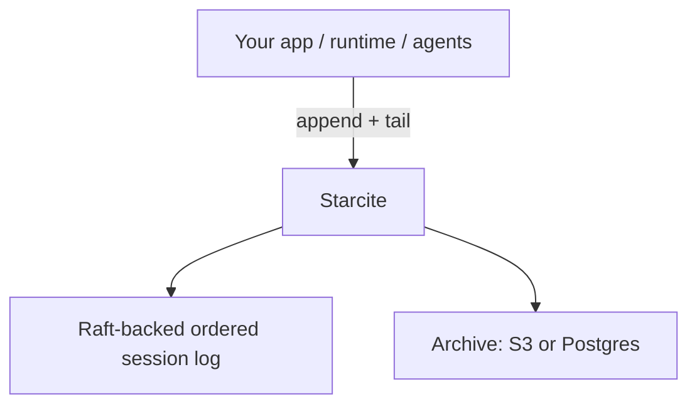

<h1 align="center">Starcite</h1>

<p align="center">
  Bulletproof streaming for AI sessions.
</p>

<p align="center">
  <a href="https://github.com/fastpaca/starcite/stargazers"></a>
  <a href="https://github.com/fastpaca/starcite/actions/workflows/test.yml"></a>
  <a href="https://github.com/fastpaca/starcite/actions/workflows/docker-build.yml"></a>
  <a href="LICENSE"></a>
</p>

Starcite is a durable, ordered session log for AI applications. Every message,
tool call, and status update is persisted before the write is acknowledged.
Consumers replay from any cursor and continue live on the same connection.

If a browser refreshes, a WebSocket drops, or work moves between agents,
the session stays intact.

[When To Use It](#when-to-use-starcite) • [Get Started](#get-started) • [API](#api-at-a-glance) • [How It Works](#how-it-works) • [Trade-offs](#trade-offs) • [Use With](#use-with) • [Docs](#documentation)

## When To Use Starcite

**Use it when** you've hit the failure modes that every production AI UI
eventually hits:

- Messages vanish when users refresh or switch tabs mid-stream
- Duplicates appear on reconnect because the server replays what the client already rendered
- Tool results show up without the tool calls that triggered them (client missed events in between)
- Multiple agents write to one session and ordering breaks
- Two tabs open the same session and show different messages
- Every deploy kills all active streams and you're writing reconnect logic

If you're patching these one by one, you're building an
[accidental message broker in your frontend](https://starcite.ai/blog/why-agent-uis-lose-messages-on-refresh).
Starcite replaces that with one primitive: an ordered, immutable session log
where catch-up and live streaming are the same operation — the cursor is the
only variable.

**Don't use it when** you're prototyping and just need to stream a model
response to a browser. Use [Vercel AI SDK](https://sdk.vercel.ai/docs),
SSE, or a plain WebSocket — that's the right tool for that job. Starcite
is for when you've outgrown that.

## Get Started

### Run Locally With Docker Compose

```bash
git clone https://github.com/fastpaca/starcite
cd starcite
docker compose up -d
curl -sS http://localhost:4000/health/live
```

This starts a single-node stack for local development:

- Starcite API on `http://localhost:4000`
- Postgres on `localhost:5433`
- MinIO on `localhost:9000`

Stop and reset:

```bash
docker compose down -v
```

For production topology and cluster operations, see
[Self-hosting](docs/self-hosting.md).

### Use A Hosted Instance

```bash
npm install -g starcite
starcite config set endpoint https://<your-instance>.starcite.io
starcite config set api-key <YOUR_API_KEY>
starcite create --id ses_demo --title "Draft contract"
starcite append ses_demo --agent researcher --text "Found 8 relevant cases..."
starcite tail ses_demo --cursor 0 --limit 1
```

For one-off use without installing globally:

```bash
npx starcite --help
```

## API At A Glance

```bash
# 1) Create a session
curl -X POST http://localhost:4000/v1/sessions \
  -H "Content-Type: application/json" \
  -d '{
    "id": "ses_demo",
    "title": "Draft contract",
    "metadata": {"tenant_id": "acme"}
  }'

# 2) Append an event
curl -X POST http://localhost:4000/v1/sessions/ses_demo/append \
  -H "Content-Type: application/json" \
  -d '{
    "type": "content",
    "payload": {"text": "Reviewing clause 4.2..."},
    "actor": "agent:drafter",
    "producer_id": "agent-drafter-1",
    "producer_seq": 1,
    "expected_seq": 1
  }'

# Response
# {"seq":1,"last_seq":1,"deduped":false}

# 3) Tail from a cursor (WebSocket)
ws://localhost:4000/v1/sessions/ses_demo/tail?cursor=0
```

Three endpoints:

- `POST /v1/sessions` — create a session
- `POST /v1/sessions/:id/append` — append an event (supports `expected_seq` for optimistic concurrency, `producer_id`/`producer_seq` for dedup)
- `GET /v1/sessions/:id/tail?cursor=N` — WebSocket: replay from cursor, then continue live

That's the whole API. [REST details](docs/api/rest.md) · [WebSocket details](docs/api/websocket.md)

## How It Works

1. A session is deterministically routed to one of 256 Raft groups (3 replicas each).
2. The leader assigns the next `seq`, replicates to quorum, and acknowledges.
3. Tail readers replay from the hot store, then continue live on the same connection.
4. A background archiver flushes committed events to S3 or Postgres without blocking writes.

**What this gives you:**

- Writes are durable before acknowledgement (quorum commit)
- Strictly monotonic `seq` per session — every reader sees the same order
- Cursor-based resume: `tail(cursor=0)` replays everything, `tail(cursor=42)` picks up where you left off
- Multiple agents can append from any node without sticky sessions
- Idempotent writes via `(producer_id, producer_seq)` dedup

**Latency:** 24ms p99 / ~120ms p99.9 append-to-ack on a 3-node EC2 cluster.

## Trade-offs

Starcite is a distributed system. You should know what you're signing up for:

**Starcite vs. just using Postgres:**
Postgres can do ordered inserts and polling. If you have a single database, low write volume, and can tolerate polling latency, a well-indexed Postgres table might be all you need. Starcite adds Raft-based replication, real-time tail via WebSocket, and cursor-based resume — but it's another system to run.

**Starcite vs. Redis Streams / Pub/Sub:**
Redis Streams give you ordered, cursor-resumable reads (`XREAD`) and are battle-tested. If you already run Redis and your sessions fit in memory, this can work well. The gap is session-scoped semantics (you build that yourself), durable archival, and the fact that Redis persistence is best-effort unless you configure it carefully.

**Starcite vs. Kafka:**
Kafka is a proven distributed log. If you already operate Kafka, you can model sessions as topics or keyed partitions. The overhead is operational complexity and the impedance mismatch between Kafka's throughput-optimized design and the latency/session-scoped semantics of interactive AI sessions.

**When Starcite is overkill:**
If you're building a single-user chat prototype, streaming one model response at a time, you don't need any of this. Use the AI SDK's built-in streaming. Come back when you're handling reconnects, multiple agents, or production UX that can't lose messages.

## Where Starcite Fits

Starcite sits below your protocol or runtime. It is the persistence and replay
layer, not the orchestration layer.



- Your runtime decides how agents talk and what events mean
- Starcite stores those events in order and lets any consumer replay or continue live
- It does not do agent discovery, prompt construction, tool calling, or orchestration

With A2A, that usually maps to:

- A2A `contextId` → one Starcite session
- A2A messages, task updates, artifacts → typed events in that session
- A2A stream resume → `tail` from the last processed cursor

## Use With

Official clients live in
[`fastpaca/starcite-clients`](https://github.com/fastpaca/starcite-clients):

- [`starcite` CLI](https://github.com/fastpaca/starcite-clients/tree/main/packages/starcite-cli) — create sessions, append events, tail streams from the terminal
- [`@starcite/sdk`](https://github.com/fastpaca/starcite-clients/tree/main/packages/typescript-sdk) — TypeScript SDK for backends and browsers
- [`@starcite/react`](https://github.com/fastpaca/starcite-clients/tree/main/packages/starcite-react) — drop-in `useChat` replacement backed by the durable session log

Or use the HTTP + WebSocket API directly from any language.

<details>
<summary>CLI</summary>

```bash
npm install -g starcite
# or: npx starcite --help

starcite config set endpoint https://<your-instance>.starcite.io
starcite config set api-key <YOUR_API_KEY>
starcite create --id ses_demo --title "Draft contract"
starcite sessions list --limit 5
starcite append ses_demo --agent researcher --text "Found 8 relevant cases..."
starcite tail ses_demo --cursor 0 --limit 1
```

</details>

<details>
<summary>TypeScript SDK</summary>

```ts
import { Starcite } from "@starcite/sdk";

const starcite = new Starcite({
  baseUrl: process.env.STARCITE_BASE_URL,
});

const session = starcite.session({ token: "<session-jwt>" });

session.on("event", (event) => {
  console.log(event.seq, event.type);
});

await session.append({
  text: "Reviewing clause 4.2...",
  source: "user",
});
```

</details>

<details>
<summary>React</summary>

`useStarciteChat` is a drop-in replacement for AI SDK's `useChat`. Your messages
survive refreshes, tab switches, and reconnects because the durable session log
is the source of truth — not ephemeral client state.

There's a working [Next.js example app](https://github.com/fastpaca/starcite-clients/tree/main/examples/nextjs-chat-ui) you can run locally.

```bash
npm install @starcite/react @starcite/sdk ai react
```

```tsx
import { Starcite } from "@starcite/sdk";
import { useStarciteChat } from "@starcite/react";

const starcite = new Starcite({
  baseUrl: process.env.NEXT_PUBLIC_STARCITE_BASE_URL,
});

export function Chat({ token }: { token: string }) {
  const session = starcite.session({ token });
  const { messages, sendMessage, status } = useStarciteChat({
    session,
    id: session.id,
  });

  return (
    <form
      onSubmit={(event) => {
        event.preventDefault();
        void sendMessage({ text: "hello" });
      }}
    >
      <button type="submit">Send</button>
      <p>Status: {status}</p>
      <pre>{JSON.stringify(messages, null, 2)}</pre>
    </form>
  );
}
```

</details>

## What Starcite Does Not Do

- Agent discovery or capability negotiation
- Prompt construction or completion orchestration
- Token budgeting or window management
- Tool or function-calling abstractions
- OAuth credential issuance

Your orchestrator stays yours.

## Documentation

- [REST API](docs/api/rest.md)
- [WebSocket API](docs/api/websocket.md)
- [Architecture](docs/architecture.md)
- [Self-hosting](docs/self-hosting.md)
- [Why Agent UIs Lose Messages on Refresh](https://starcite.ai/blog/why-agent-uis-lose-messages-on-refresh) (blog)

## Development

```bash
git clone https://github.com/fastpaca/starcite && cd starcite
mix deps.get
mix compile
mix phx.server  # http://localhost:4000
mix precommit   # format + compile (warnings-as-errors) + test
```

## Contributing

1. Fork and create a branch.
2. Add tests for behavior changes.
3. Run `mix precommit` before opening a PR.

## License

Apache 2.0
