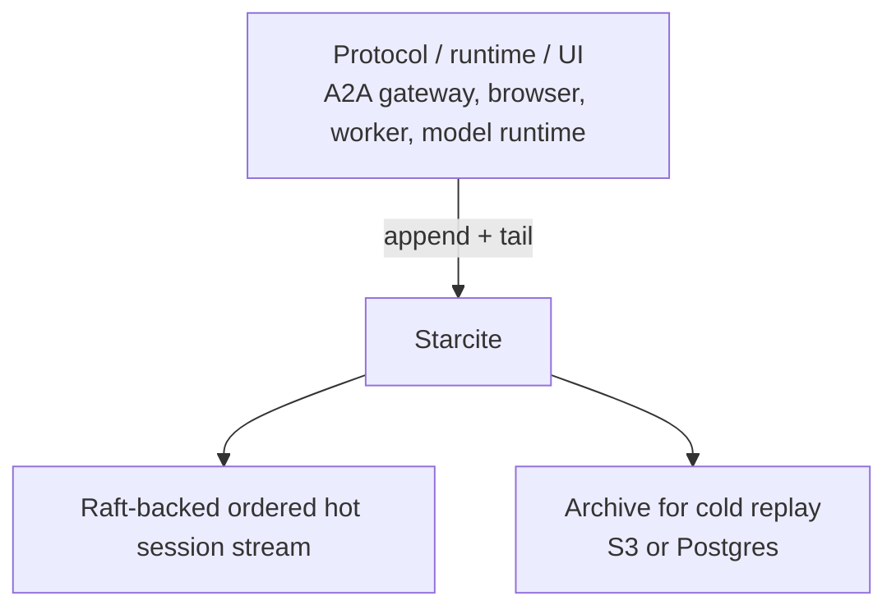

<h1 align="center">Starcite</h1>

<p align="center">
  The durable ordered interaction stream beneath AI protocols and runtimes.
</p>

<p align="center">
  <a href="https://github.com/fastpaca/starcite/actions/workflows/test.yml"></a>
  <a href="https://github.com/fastpaca/starcite/actions/workflows/docker-build.yml"></a>
  <a href="LICENSE"></a>
  <a href="https://elixir-lang.org/"></a>
</p>

[What It Is](#what-starcite-is) • [Where It Fits](#where-starcite-fits) • [Get Started](#get-started) • [Use With](#use-with) • [REST API](docs/api/rest.md) • [WebSocket API](docs/api/websocket.md) • [Architecture](docs/architecture.md) • [Self-hosting](docs/self-hosting.md)

## What Starcite Is

Starcite stores the canonical history of what happened inside an AI interaction
as one durable, ordered session stream.

That stream can include:

- user messages
- model output and streamed chunks
- tool calls and tool results
- agent handoffs and task updates
- human approvals and workflow state transitions

One Starcite session is one interaction log. In practice that might be:

- a user + agent conversation
- an agent workflow run
- a collaborative session shared by humans and agents
- any AI event stream that must be replayable later

If a browser refreshes, a WebSocket drops, a worker retries, or work moves
between runtimes, Starcite keeps the canonical sequence intact. Appends are
committed before acknowledgement. Consumers replay from any cursor and continue
live on the same connection.

## Why Teams Use It

- keep browsers, agents, workers, and audit consumers aligned to the same ordered history
- survive retries, redeploys, and dropped connections without rebuilding session state
- recover long-running AI workflows instead of inventing ad hoc cursor and reconnect logic
- make multi-producer writes safe with optimistic concurrency and deterministic de-duplication

## Where Starcite Fits

Starcite sits below the protocol or runtime layer. It is the persistence and
replay layer, not the orchestration layer.



This is the boundary:

- protocols and runtimes decide how agents talk and what events mean
- Starcite stores those events as one ordered stream and lets consumers replay or continue live
- storage and replication stay below Starcite

With A2A, that usually means:

- A2A `contextId` -> one Starcite session
- A2A messages, task status updates, and artifacts -> typed events in that session
- A2A stream resume -> tail from the last processed cursor

## Get Started

### Run Locally With Docker Compose

```bash
git clone https://github.com/fastpaca/starcite
cd starcite
docker compose up -d
curl -sS http://localhost:4000/health/live
```

This starts a single-node stack for local development:

- Starcite API on `http://localhost:4000`
- Postgres on `localhost:5433`
- MinIO on `localhost:9000`

Stop and reset it with:

```bash
docker compose down -v
```

For production topology and cluster operations, see
[Self-hosting](docs/self-hosting.md).

### Use A Hosted Instance

```bash
npm install -g starcite
starcite config set endpoint https://<your-instance>.starcite.io
starcite config set api-key <YOUR_API_KEY>
starcite create --id ses_demo --title "Draft contract"
starcite append ses_demo --agent researcher --text "Found 8 relevant cases..."
starcite tail ses_demo --cursor 0 --limit 1
```

For one-off use without installing globally:

```bash
npx starcite --help
```

## Use With

Official clients and the terminal CLI live in
[`fastpaca/starcite-clients`](https://github.com/fastpaca/starcite-clients).

Pick the surface you want. They all speak the same session model:

- [`starcite` CLI](https://github.com/fastpaca/starcite-clients/tree/main/packages/starcite-cli) for terminal workflows
- [`@starcite/sdk`](https://github.com/fastpaca/starcite-clients/tree/main/packages/typescript-sdk) for app and browser integration
- [`@starcite/react`](https://github.com/fastpaca/starcite-clients/tree/main/packages/starcite-react) for durable session chat hooks

<details>
<summary>CLI</summary>

Use the CLI when you want to create sessions, append events, and inspect the
ordered timeline from the terminal.

Install globally:

```bash
npm install -g starcite
```

Or run once without installing:

```bash
npx starcite --help
```

Example:

```bash
starcite config set endpoint https://<your-instance>.starcite.io
starcite config set api-key <YOUR_API_KEY>
starcite create --id ses_demo --title "Draft contract"
starcite sessions list --limit 5
starcite append ses_demo --agent researcher --text "Found 8 relevant cases..."
starcite tail ses_demo --cursor 0 --limit 1
```

</details>

<details>
<summary>TypeScript</summary>

Use the TypeScript SDK when you want to create sessions, append events, and
live-sync the canonical session log from Node.js or the browser.

Install:

```bash
npm install @starcite/sdk
```

```ts
import { Starcite } from "@starcite/sdk";

const starcite = new Starcite({
  baseUrl: process.env.STARCITE_BASE_URL,
});

const session = starcite.session({ token: "<session-jwt>" });

session.on("event", (event) => {
  console.log(event.seq, event.type);
});

await session.append({
  text: "Reviewing clause 4.2...",
  source: "user",
});
```

</details>

<details>
<summary>React</summary>

Use the React package when you want a durable chat-style UI driven by the same
ordered session log.

Install:

```bash
npm install @starcite/react @starcite/sdk ai react
```

```tsx
import { Starcite } from "@starcite/sdk";
import { useStarciteChat } from "@starcite/react";

const starcite = new Starcite({
  baseUrl: process.env.NEXT_PUBLIC_STARCITE_BASE_URL,
});

export function Chat({ token }: { token: string }) {
  const session = starcite.session({ token });
  const { messages, sendMessage, status } = useStarciteChat({
    session,
    id: session.id,
  });

  return (
    <form
      onSubmit={(event) => {
        event.preventDefault();
        void sendMessage({ text: "hello" });
      }}
    >
      <button type="submit">Send</button>
      <p>Status: {status}</p>
      <pre>{JSON.stringify(messages, null, 2)}</pre>
    </form>
  );
}
```

</details>

## Core Guarantees

- Durable writes: appends are committed before acknowledgement
- Deterministic ordering: strictly monotonic `seq` per session
- Replay and live continuation: replay from any cursor, then keep reading on the same connection
- Concurrency safety: optional `expected_seq` checks on append
- Idempotency: `(producer_id, producer_seq)` de-duplication
- Same stream contract everywhere: browsers, workers, agents, and services consume the same ordered history
- Low-latency append path: sub-150ms p99 commit path with Raft-backed ordering

## How It Works

1. A session is deterministically routed to a Raft group.
2. The leader assigns the next `seq`, replicates to quorum, and acknowledges the append.
3. Tail readers replay from the hot store and archive as needed, then continue live.
4. A background archiver flushes committed events to S3 or Postgres without blocking writes.

The public API stays intentionally small:

- create a session
- append an event
- tail from a cursor

That small surface area is the point. Starcite is meant to be the reliable
stream underneath your application protocol, not another protocol to learn.

## API At A Glance

```bash
# 1) Create a session
curl -X POST http://localhost:4000/v1/sessions \
  -H "Content-Type: application/json" \
  -d '{
    "id": "ses_demo",
    "title": "Draft contract",
    "metadata": {"tenant_id": "acme"}
  }'

# 2) Append an event
curl -X POST http://localhost:4000/v1/sessions/ses_demo/append \
  -H "Content-Type: application/json" \
  -d '{
    "type": "content",
    "payload": {"text": "Reviewing clause 4.2..."},
    "actor": "agent:drafter",
    "producer_id": "agent-drafter-1",
    "producer_seq": 42,
    "expected_seq": 1
  }'

# Response
# {"seq":42,"last_seq":42,"deduped":false}

# 3) Tail from a cursor (WebSocket)
ws://localhost:4000/v1/sessions/ses_demo/tail?cursor=0
```

REST and WebSocket details:

- `POST /v1/sessions`
- `GET /v1/sessions`
- `POST /v1/sessions/:id/append`
- `GET /v1/sessions/:id/tail`

Append supports optimistic concurrency with `expected_seq` and deterministic
de-duplication with `(producer_id, producer_seq)`. Tail replays ordered history
and then continues live on the same socket.

## What Starcite Does Not Do

Starcite is deliberately narrow. It does not do:

- agent discovery or capability negotiation
- prompt construction or completion orchestration
- token budgeting or window management
- tool or function-calling abstractions
- OAuth credential issuance
- cross-system agent lifecycle orchestration

## Documentation

- [REST API](docs/api/rest.md)
- [WebSocket API](docs/api/websocket.md)
- [Architecture](docs/architecture.md)
- [Self-hosting](docs/self-hosting.md)

## Development

```bash
git clone https://github.com/fastpaca/starcite && cd starcite
mix deps.get
mix compile
mix phx.server  # http://localhost:4000
mix precommit   # format + compile (warnings-as-errors) + test
```

## Contributing

1. Fork and create a branch.
2. Add tests for behavior changes.
3. Run `mix precommit` before opening a PR.

## License

Apache 2.0
