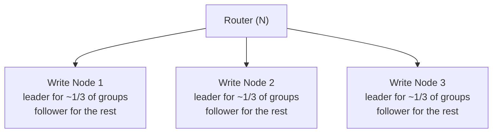
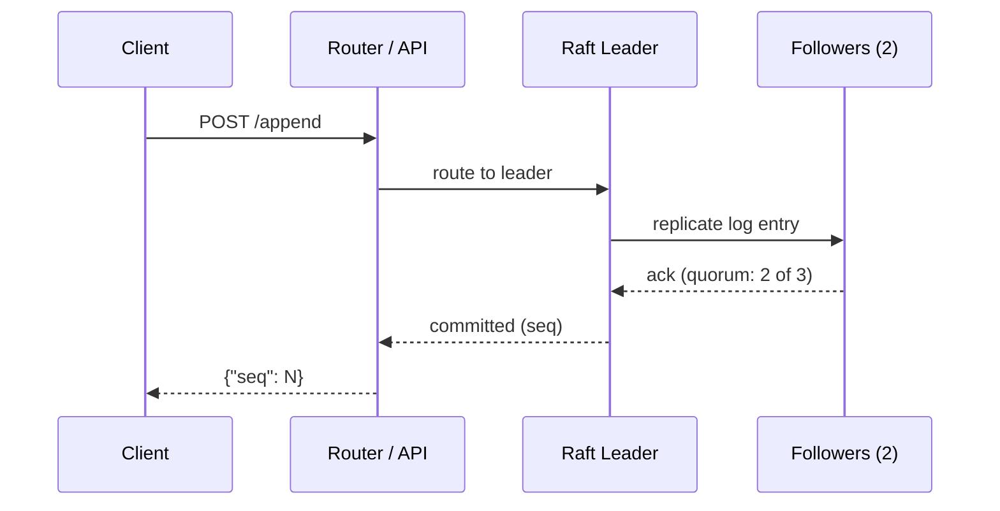
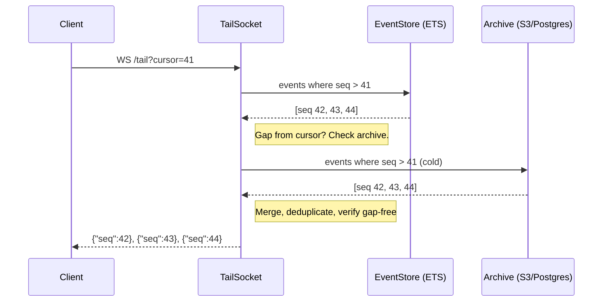
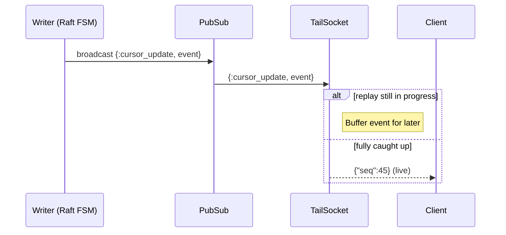
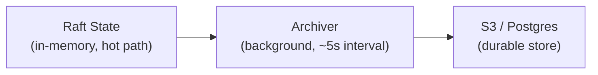

# Architecture

Starcite is a clustered session-stream service. Each session is an ordered,
append-only event log. The system is optimized for one thing: low-latency durable
appends with cursor-based replay.

This page explains how it works internally.

## Cluster topology

A Starcite cluster consists of a fixed set of write nodes (typically 3 or 5) and
optional stateless router nodes for read scaling.

Write nodes hold all the state. Sessions are deterministically sharded across a
configurable number of groups (256 by default, controlled by `STARCITE_NUM_GROUPS`),
and each group is replicated across 3 write nodes using
[Raft](https://raft.github.io/) consensus (via Erlang's
[Ra](https://github.com/rabbitmq/ra) library). One replica is elected leader; the
others are followers.

Router nodes are stateless — they accept API traffic and forward commands to the
correct write node. You can scale these independently.

The group count is set at deploy time and stays fixed for the life of the cluster.
Sessions are assigned to groups by hashing the session ID — this is deterministic, so
any node can compute the group for any session without coordination.

## Write path (append)

The append path is the critical path. Target: sub-150ms p99.

Step by step:

1. Client sends `POST /v1/sessions/:id/append`.
2. The API layer validates the request (JWT, payload shape, tenant fencing).
3. The request is routed to the Raft leader for this session's group.
4. The leader assigns the next monotonic `seq`, appends to its log, and replicates
   to followers.
5. Once a quorum (2 of 3 replicas) acknowledges, the append is committed.
6. The client receives the committed `seq`. Tail subscribers are notified.

**What's NOT on this path:** database writes, archive flushes, snapshots. The entire
write path operates on in-memory Raft state. This is why appends are fast.

**Deduplication:** If the client retries with the same `(producer_id, producer_seq)`,
the leader returns the previously committed `seq` with `deduped: true` instead of
creating a duplicate entry.

**Optimistic concurrency:** If the client sends `expected_seq` and it doesn't match
the session's current `seq`, the append is rejected with a `409`.

## Read path (tail)

Tail is a WebSocket endpoint that replays committed events from a cursor, then
streams new commits live. There are two distinct phases: replay and live streaming.

### Replay phase

On connect, the server fetches historical events using a two-tier read path:

The **hot tier** is the in-memory EventStore — an ETS table holding events that are
still in the Raft log. This is the fast path. If there's a gap between the cursor and
the oldest hot event (because the Raft log was compacted), the server falls back to
the **cold tier** — the archive backend (S3 or Postgres). Results are merged,
deduplicated by `seq`, and verified to be gap-free before sending.

Events are drained to the client in batches (configurable via `batch_size` query
param, default 1, max 1000 events per WebSocket frame).

### Live streaming phase

While replay is in progress, the TailSocket subscribes to a PubSub topic for the
session. When the write path commits an event, the Raft state machine broadcasts it
via PubSub:

Events that arrive via PubSub during replay are buffered. Once replay is complete,
buffered events are resolved and flushed to the client before switching to pure live
mode.

### Gap detection

PubSub messages can be missed during Raft leadership transitions. A catchup timer
runs every 5 seconds — if it detects that the EventStore has events beyond the
socket's cursor, it re-enters replay mode to close the gap. This acts as a safety net
so clients never silently miss events.

### Reconnection

Clients recover from disconnects by reconnecting with their last processed `seq` as
the cursor. No client-side bookkeeping beyond remembering one integer.

## Archival

A background archiver flushes committed events to the configured storage backend (S3
or Postgres) on a ~5 second interval. This is fully asynchronous — archive writes
never block appends or tail delivery.

The archiver is idempotent: it writes events keyed by `(session_id, seq)`, so
retries and overlapping flushes are safe.

**Why this design:** Synchronous archive writes would add tens of milliseconds to
every append. Since Raft replication already guarantees durability across node
failures, the archive serves as a secondary durability layer and a source for
historical queries. The trade-off is that the archive lags the live cluster by a few
seconds.

After events are archived, the Raft log can be compacted — archived events no longer
need to live in memory.

## Snapshots and recovery

Raft snapshots capture the full state of a group at a point in time. They're used for
two things:

1. **Log compaction** — without snapshots, the Raft log would grow unbounded.
   Snapshots are triggered after ~100k appends per group.
2. **Node recovery** — when a node restarts or falls behind, it can load the latest
   snapshot and replay only the log entries after it, instead of replaying the entire
   history.

Snapshots are taken asynchronously and don't block the write path.

## What's in Raft state

Each Raft group holds the state for its assigned sessions:

- Session metadata (id, title, tenant, creation time)
- The ordered event log (seq, type, payload, actor, producer info, etc.)
- Producer deduplication state (last seen `producer_seq` per `producer_id`)
- Archive progress (`archived_seq` — how far the archiver has flushed)

This is why Starcite doesn't need synchronous database reads on the hot path — all
the data needed to serve appends and tail is in Raft memory.

## Failure modes

**Single node failure:** The remaining 2 of 3 replicas maintain quorum. Appends
continue. Leaders on the failed node are re-elected on surviving nodes within
seconds. Clients see a brief latency spike during leader election, not data loss.

**Two node failure (3-node cluster):** Quorum is lost. Groups that had leaders on the
surviving node can still serve reads (tail replay from local state), but new appends
are rejected until quorum is restored.

**Network partition:** Raft's leader election prevents split-brain. A leader that
can't reach a quorum steps down. Appends are unavailable on the minority side of the
partition.

**Full cluster restart:** Nodes recover from their local Raft log and snapshots. No
data is lost as long as persistent volumes survive.

## Static topology

Starcite uses a static cluster topology — the set of write nodes is configured at
deploy time and doesn't change automatically. This is a deliberate choice:

- Static membership is simpler to reason about than dynamic membership protocols.
- There's no risk of accidental split-brain from a membership change during a
  partition.
- Adding or removing nodes is an explicit maintenance operation, not something that
  happens by surprise.

The cost: scaling the write tier requires a maintenance window. In practice, 3-5
write nodes handle substantial throughput because the bottleneck is typically network
and disk, not CPU.
