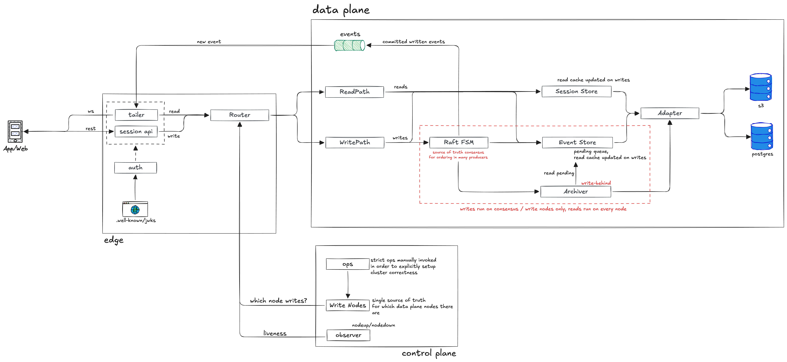
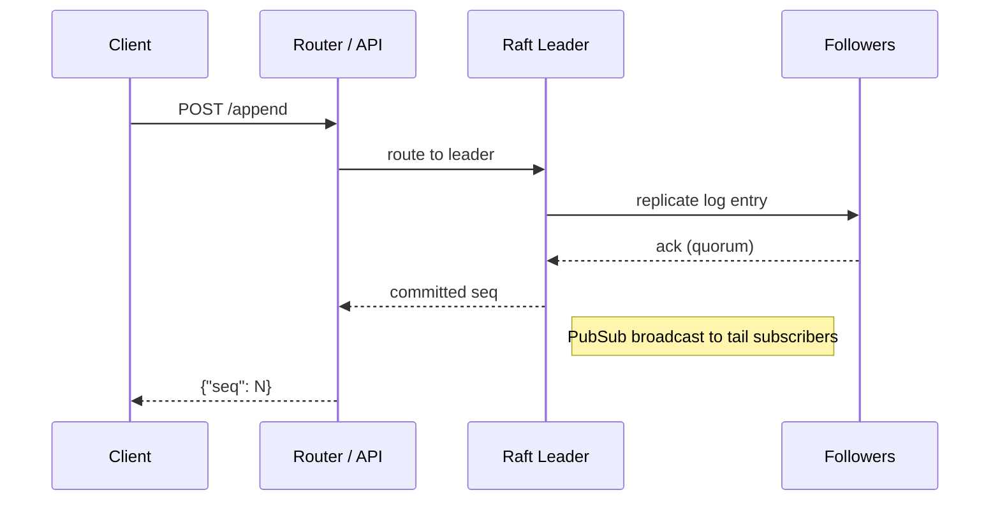
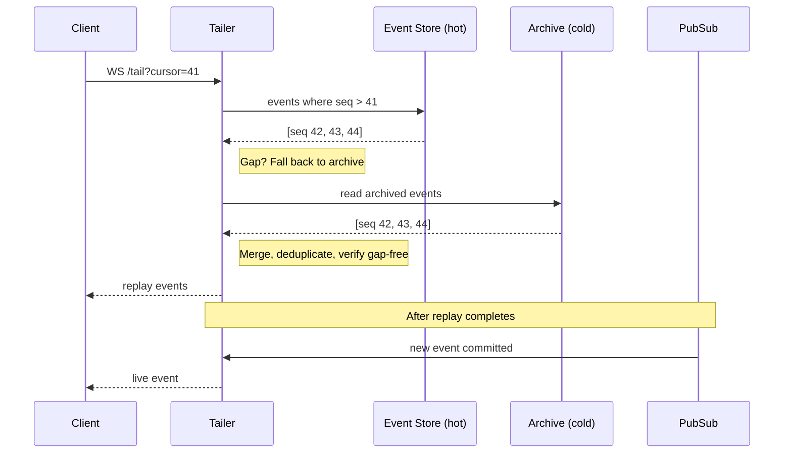
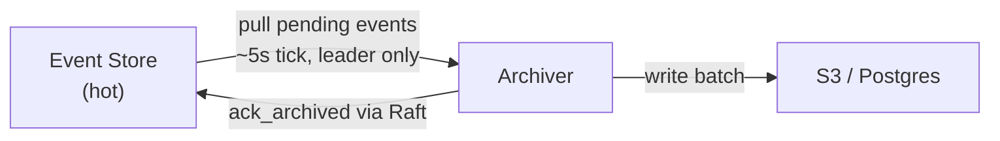

# Architecture

Starcite is a clustered session-stream service. Each session is an ordered,
append-only event log, optimized for low-latency durable appends with cursor-based
replay.

The system has three layers: **edge**, **data plane**, and **control plane**.

## Edge

The edge handles client connections, auth, and protocol translation.

**Session API** — REST endpoints for creating sessions, appending events, and listing
sessions. Validates input, enforces tenant fencing, and delegates to the data plane.

**Tailer** — WebSocket handler for `tail`. Upgrades to a long-lived process that
manages replay and live streaming. This is the only stateful process per client
connection.

**Auth** — Validates bearer JWTs on every `/v1` request against JWKS keys. Builds an
auth context (principal, scopes, tenant) used for policy enforcement downstream.
WebSocket connections accept the token as a header or query param.

## Data plane

The data plane owns session state, event ordering, and durable storage. Writes run on
write nodes only (consensus). Reads run on every node.

### Router

Routes requests to the correct Raft group. Session-to-group assignment is a
deterministic hash. Group-to-replica assignment is also deterministic — scored by
hashing `{group, node}` pairs, top N become replicas.

Writes route to the Raft leader (with a cached leader hint). Reads route to any ready
replica. On a stale leader hint, the router retries using the hint from the response.

### Write path

The API validates the request and routes to the Raft leader for the session's group.
The leader assigns the next monotonic `seq`, replicates to followers, and after quorum
commit produces a PubSub broadcast — this is how tail subscribers learn about new
events in real time.

Session metadata and read caches are warmed after a successful append, but neither is
on the critical path.

**Deduplication:** `(producer_id, producer_seq)` pairs are tracked per session. A
retry with the same pair returns the original `seq` with `deduped: true`.

**Optimistic concurrency:** If `expected_seq` doesn't match the session's current
`seq`, the append is rejected with `409`.

### Read path (tail)

Tail connects as a WebSocket and operates in two phases:

**Replay** — fetches historical events from a two-tier store. The hot tier holds
recent unarchived events in memory. If there's a gap (older events were archived and
evicted), the cold tier (S3 or Postgres) fills it in. Results are merged and verified
gap-free.

**Live** — the tailer subscribes to PubSub for the session at connect time. Events
arriving during replay are buffered and flushed once replay completes. After that, new
commits are pushed to the client immediately.

A periodic catchup timer (every 5s) detects missed PubSub messages — if the event
store has advanced past the socket's cursor, it re-enters replay. This handles
edge cases like leadership transitions where a broadcast might be missed.

### Raft FSM

The state machine at the heart of the data plane. Each Raft group holds state for all
sessions assigned to it: session metadata, ordered event logs, producer deduplication
state, and archive progress.

On commit, the FSM assigns the next `seq` and produces a PubSub side effect. On
`ack_archived`, it advances the archive cursor so evicted events can be reclaimed.

### Event Store and Session Store

**Event Store** — in-memory store for unarchived events, plus a read cache for
recently accessed archived events. The read path checks here first (hot), falls back
to the archive (cold). Has memory pressure management to bound total usage.

**Session Store** — cache for session metadata. Avoids hitting the archive on every
session lookup. Misses load from the archive backend.

Both are populated on writes and read-through on misses.

### Archiver

Background process that pulls committed events from the event store and flushes them
to the archive backend. Runs on a ~5 second tick, leader-only per group (prevents
duplicate writes across replicas).

After a successful flush, sends `ack_archived` back through Raft so the event store
can evict those events from memory. Archive writes are idempotent — safe across
retries and overlapping flushes.

The archiver never touches the critical path. If it falls behind or fails, appends
and tail continue unaffected.

## Control plane

The control plane manages cluster topology and node liveness. It doesn't touch the
request path — it only affects which nodes are eligible for routing.

**Write Nodes** — static configuration. The set of write node identities, group
count, and replication factor are defined at deploy time. Group-to-replica assignment
is fully deterministic from this config — every node computes the same answer with no
coordination.

**Observer** — tracks write-node liveness via Erlang distribution events. Nodes
transition through statuses: ready → suspect (lost visibility) → lost (suspect too
long). Operators can mark nodes as draining, which is sticky and excludes them from
routing without removing them from Raft groups.

**Ops** — operator commands (`drain`, `undrain`, `status`, `ready-nodes`,
`wait-ready`, `wait-drained`). Drain is non-destructive and reversible. See the
[self-hosting guide](self-hosting.md) for operational runbooks.

**Cluster discovery** — nodes find each other via
[libcluster](https://github.com/bitwalker/libcluster) using either static EPMD or
Kubernetes DNS polling.

**Bootstrap** — on startup, each write node starts Raft servers for its assigned
groups and triggers leader election. The node reports not-ready until all local groups
are healthy.

## Failure modes

**Single node failure:** Quorum holds. Leaders re-elected within seconds. Clients see
a brief latency spike, not data loss.

**Two-node failure (3-node cluster):** Quorum lost. Reads may still work, appends
rejected. Restore the failed nodes.

**Network partition:** Leader steps down on the minority side. No split-brain.

**Full cluster restart:** Nodes recover from local Raft log and checkpoints. No data
lost if persistent volumes survive.

**Missed PubSub during leader transition:** Catchup timer detects the gap and
re-enters replay. Clients never silently miss events.
