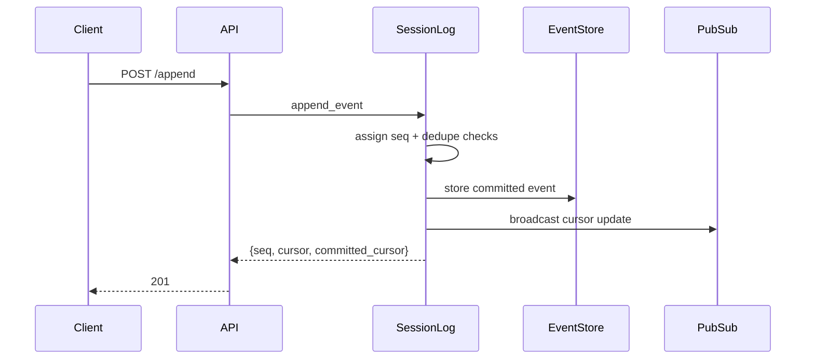
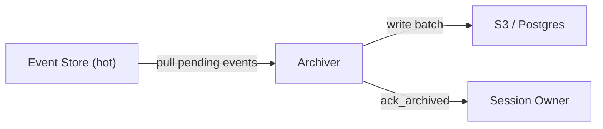

# Architecture

Starcite is a clustered session-stream service. Each session is an ordered,
append-only event stream with cursor-based replay and low-latency live delivery.

The system has three layers: **edge**, **data plane**, and **control plane**.

## Edge

The edge handles client protocol, auth, and policy enforcement.

**Session API** - REST endpoints for create/append/list. Validates payloads,
enforces tenant/session scope, and delegates to the data plane.

**Tailer** - WebSocket handler for `/tail`. Replays historical events from cursor,
then streams live updates. Buffers live updates during replay and flushes when
replay completes.

**Auth** - Validates JWT bearer tokens against JWKS and derives principal context
(tenant, scopes, subject/session constraints) for policy checks.

## Data plane

The data plane owns session sequencing, replay semantics, hot event retention, and
async archival.

### Session logs

One session-log process exists per active session replica on a node.

Log responsibilities:
- Assign monotonic `seq` per session.
- Enforce producer dedupe and optimistic concurrency (`expected_seq`).
- Write committed events to hot event store.
- Broadcast cursor updates to PubSub for tail subscribers.
- Track archive progress (`archived_seq`) and apply archive acknowledgements.

The append hot path is owner-based and does not call control-plane consensus.

### Write path

```mermaid
sequenceDiagram
    participant C as Client
    participant A as API
    participant O as SessionLog
    participant E as EventStore
    participant P as PubSub

    C->>A: POST /append
    A->>O: append_event
    O->>O: assign seq + dedupe checks
    O->>E: store committed event
    O->>P: broadcast cursor update
    O-->>A: {seq, cursor, committed_cursor}
    A-->>C: 201
```

### Read path (tail)

Tail has two phases:

**Replay** - reads events where `seq > cursor` from hot store and cold archive,
merges, deduplicates, and verifies gap-free order.

**Live** - subscribes to cursor-update PubSub and pushes new events as they arrive.

Cursor contract:
- Cursor includes `(epoch, seq)`.
- Reconnects are resumable by cursor.
- If replay continuity cannot be guaranteed, server emits explicit `gap` frames
  with `reason`, `from_cursor`, and `next_cursor`.

### Event store and session store

**Event store** - in-memory hot storage for unarchived events plus archived-read
cache for replay acceleration.

**Session store** - cache of session metadata/state used by API/auth/read paths and
owner rehydration after owner restarts.

### Archiver

```mermaid
graph LR
    E["Event Store (hot)"] -- "pull pending events" --> AR["Archiver"]
    AR -- "write batch" --> S["S3 / Postgres"]
    AR -- "ack_archived" --> O["Session Owner"]
```

A background worker periodically flushes committed hot events to archive storage.
After a successful flush, it calls archive ack on the local session log, which advances
`archived_seq` and evicts archived hot entries.

Archive writes are idempotent. Archiver failures do not block append/tail hot paths.

## Control plane

The control plane manages routing, ownership, fencing, and operator workflows.
It does not sequence or store per-event payloads.

Current direction:
- One Khepri store is the authoritative control-plane state.
- Session ownership is an explicit claim, not a deterministic hash lookup.
- Ownership is fenced by monotonic session `epoch`.
- Nodes publish lifecycle state (`ready`, `draining`, `drained`) and renew a
  node-level lease in Khepri.
- Manual drain moves sessions away from a node via explicit ownership transfer.
- Catastrophic failover is driven by lease expiry, not by raw `nodedown`.
- `nodedown` is only a routing hint for faster local failure handling.

Control-plane state:
- `nodes/<node>`: node state and lease.
- `sessions/<session_id>`: owner, epoch, replicas, and transfer state.

This keeps consensus off the append path while still making ownership changes
deterministic and durable.

## Failure modes

**Session log crash:** The local log process restarts and rehydrates from session cache.
Short blips may return temporary timeout; retries succeed after restart.

**Node failure:** Sessions owned on that node remain fenced to the existing owner
until its control-plane lease expires. After lease expiry, ownership is moved and
`epoch` is bumped.

**Rolling maintenance:** Expected path is `draining -> drained -> stop`. Sessions
move explicitly before the node is taken down.

**Archive lag/failure:** Live delivery continues; archival watermark stops advancing
until storage recovers.

**Missed PubSub update:** Tail catchup timer re-enters replay when hot store cursor
is ahead of socket cursor.
