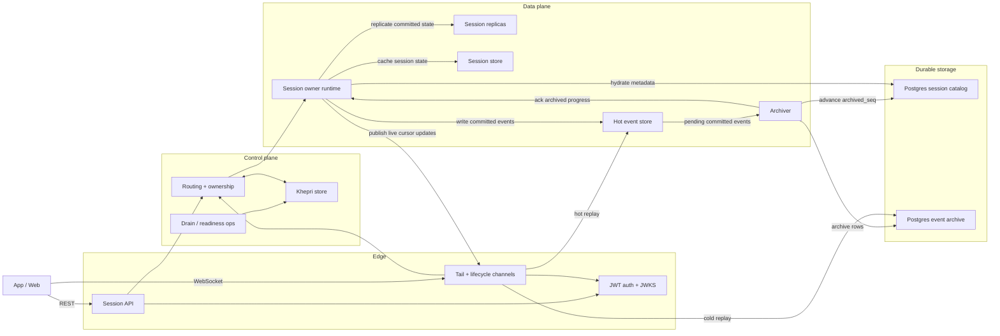
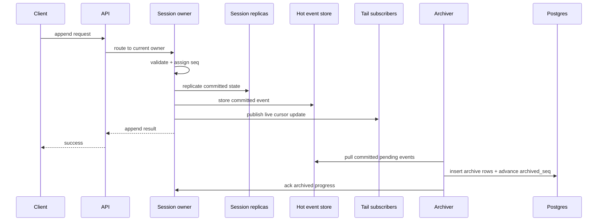

# Architecture

Starcite is a clustered session-stream service for AI applications. Each
session is one ordered, append-only event log that supports replay from a
cursor and low-latency live delivery.

At a high level:

- clients can talk to any node
- one node is the current owner for a given session epoch
- the owner sequences appends and replicates committed state to session replicas
- hot events stay in memory for fast replay and live tailing
- a background archiver flushes committed history into Postgres
- Khepri tracks node readiness, ownership, and failover state

Durability is intentionally simple: Postgres is the only durable store for
session metadata, `archived_seq`, and archived event rows. In-memory
replication improves failover safety, but it is not the durability layer.

```mermaid
flowchart LR
    Client["App / Web"]

    subgraph Edge["Edge"]
        API["Session API"]
        Tail["Tail + lifecycle channels"]
        Auth["JWT auth + JWKS"]
    end

    subgraph Control["Control plane"]
        Router["Routing + ownership"]
        Khepri["Khepri store"]
        Ops["Drain / readiness ops"]
    end

    subgraph Data["Data plane"]
        Owner["Session owner runtime"]
        Replicas["Session replicas"]
        Hot["Hot event store"]
        SessionState["Session store"]
        Archiver["Archiver"]
    end

    subgraph Durable["Durable storage"]
        PGSessions["Postgres session catalog"]
        PGEvents["Postgres event archive"]
    end

    Client -->|REST| API
    Client -->|WebSocket| Tail
    API --> Auth
    Tail --> Auth
    API --> Router
    Tail --> Router
    Ops --> Khepri
    Router <--> Khepri
    Router --> Owner
    Owner -->|replicate committed state| Replicas
    Owner -->|write committed events| Hot
    Owner -->|publish live cursor updates| Tail
    Owner -->|cache session state| SessionState
    Hot -->|pending committed events| Archiver
    Archiver -->|archive rows| PGEvents
    Archiver -->|advance archived_seq| PGSessions
    Archiver -->|ack archived progress| Owner
    Owner -->|hydrate metadata| PGSessions
    Tail -->|cold replay| PGEvents
    Tail -->|hot replay| Hot
```

## System model

Starcite splits cleanly into three concerns:

- **Edge** handles protocol, auth, and policy checks.
- **Data plane** owns sequencing, replay, hot retention, and archive progress.
- **Control plane** owns routing, fencing, readiness, and failover.

That separation is the main architectural rule: ownership and failover are
durable and explicit, but event sequencing and live delivery stay off the
control-plane path.

## Edge

The edge is the public-facing entry point.

**Session API**

REST endpoints handle session create, append, list, archive, unarchive, and
header update operations. The API validates input, enforces tenant and session
policy, and routes the command to the current session owner.

**Tail channels**

Clients connect one Phoenix socket at `/v1/socket` and join `tail:<session_id>`
or `lifecycle` topics. Tail channels replay historical events from the supplied
cursor, then continue on the live stream without switching protocols or
connections.

**Auth**

Default auth validates JWT bearer tokens against JWKS and derives the principal
context used for tenant and scope enforcement. `STARCITE_AUTH_MODE=none` is an
explicit no-auth mode for local or tightly controlled environments.

## Data plane

The data plane owns per-session ordering, replay semantics, and the handoff
from hot memory into durable storage.

### Session ownership and sequencing

Each active session has one owner for the current epoch. That owner runtime is
the only place allowed to sequence new events.

Owner responsibilities:

- assign monotonic `seq` values
- enforce `expected_seq`
- enforce `(producer_id, producer_seq)` dedupe
- replicate committed state to session replicas before acknowledging success
- publish live cursor updates after commit
- track archive progress via `archived_seq`

Replica responsibilities:

- keep a standby copy of committed session state
- take over only after ownership changes and the epoch is bumped
- never accept owner writes directly

This gives Starcite low-latency appends without putting control-plane consensus
on every write.

### Hot state

Hot state is local, in-memory, and optimized for replay plus live tailing.

**Hot event store**

The hot event store keeps unarchived committed events in memory. It is the
first source for replay and the source of truth for immediate live delivery.

**Archive read cache**

Archived reads are cached locally after Postgres fetches so repeated replay does
not keep hitting durable storage.

**Session store**

The session store caches dynamic session state such as `epoch`, `last_seq`, and
`archived_seq`. Cold session hydrate starts from the durable session catalog,
then rebuilds local runtime state from there.

### Durable storage

Postgres is the durable backing store for the whole archive layer.

**Session catalog**

One row per session stores durable metadata plus the archival frontier
`archived_seq` and archived visibility state.

**Event archive**

Archived rows are stored in Postgres in session/sequence order and are used for
cold replay once data has moved out of hot memory.

### Archiver

The archiver is a background worker that periodically scans local hot state,
persists committed rows into Postgres, advances `archived_seq` in the session
catalog, and then acknowledges archived progress back to the local owner.

Important properties:

- archive writes are asynchronous and stay off the append acknowledgment path
- archive writes are idempotent
- a successful archive flush allows hot eviction to move forward
- archive lag does not stop live delivery; it only delays cold durability

```mermaid
sequenceDiagram
    participant C as Client
    participant A as API
    participant O as Session owner
    participant R as Session replicas
    participant H as Hot event store
    participant T as Tail subscribers
    participant AR as Archiver
    participant PG as Postgres

    C->>A: append request
    A->>O: route to current owner
    O->>O: validate + assign seq
    O->>R: replicate committed state
    O->>H: store committed event
    O->>T: publish live cursor update
    O-->>A: append result
    A-->>C: success
    AR->>H: pull committed pending events
    AR->>PG: insert archive rows + advance archived_seq
    AR->>O: ack archived progress
```

## Replay and tail

Tailing has two phases:

**Replay**

The server reads any needed archived history from Postgres, merges it with hot
events still in memory, sorts by sequence, removes duplicates, and verifies the
result is gap-free.

**Live**

Once replay is complete, the same channel stays subscribed to live cursor
updates and pushes new events as they commit.

Public cursor rules:

- cursors are sequence-based
- reconnect is always "replay from last processed cursor"
- replay gaps are explicit, never silent
- if continuity cannot be guaranteed, the server emits a `gap` frame with the
  reason and the next safe cursor boundary

## Control plane

The control plane owns routing and failover. It does not store per-event
payloads and it does not sequence writes.

Khepri is the authoritative store for:

- node readiness state
- node leases
- session owner
- session epoch
- transfer state during drain or failover

Key behaviors:

- ownership is an explicit claim, not a hash lookup
- stale writers are fenced by epoch
- draining moves sessions away deliberately
- catastrophic failover happens after lease expiry, not just raw `nodedown`
- `nodedown` is only a hint for faster local reaction

This is what lets Starcite keep routing state durable without paying
control-plane consensus cost on every append.

## Failure behavior

**Session runtime crash**

The runtime restarts, reloads durable metadata, restores local state, and
continues from the current epoch. Short blips may surface as timeouts, but
retries succeed after restart.

**Node failure**

The failed owner remains fenced until its lease expires. After expiry, routing
moves ownership, bumps the epoch, and the new owner resumes sequencing.

**Rolling maintenance**

The expected path is `ready -> draining -> drained -> stop`. Sessions are moved
before shutdown instead of relying on abrupt failure handling.

**Archive lag or Postgres trouble**

Live append and hot replay can continue while archive durability is behind.
What stops progressing is the archival frontier, not the hot path.

**Missed live update**

Tail falls back to replay when the socket cursor falls behind the hot cursor, so
missed PubSub delivery does not become silent event loss.
