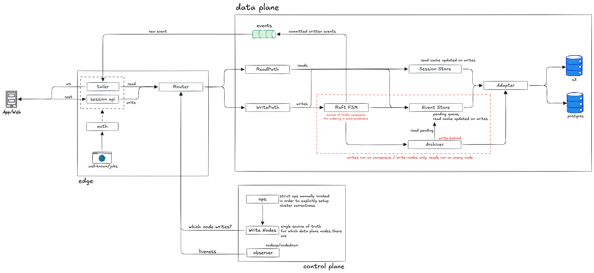
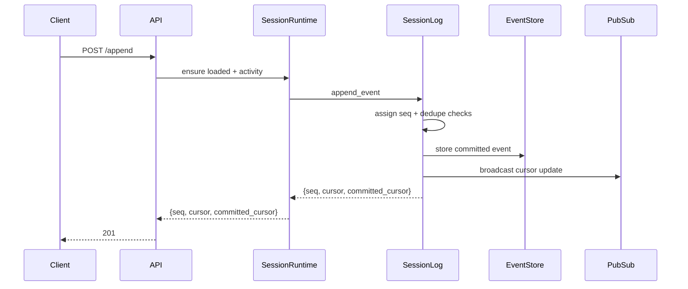
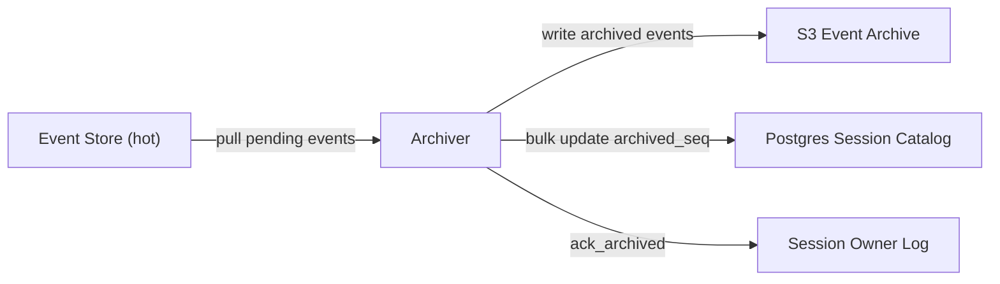

# Architecture

Starcite is a clustered session-stream service. Each session is an ordered,
append-only event stream with cursor-based replay and low-latency live delivery.

The system has three layers: **edge**, **data plane**, and **control plane**.

## Edge

The edge handles client protocol, auth, and policy enforcement.

**Session API** - REST endpoints for create/append/list. Validates payloads,
enforces tenant/session scope, and delegates to the data plane.

**Phoenix Channels** - Clients connect one socket at `/v1/socket`, then join
`tail:<session_id>` and `lifecycle` topics. Tail channels replay historical
events from cursor, then stream live updates. Live updates are buffered during
replay and flushed when replay completes.

**Auth** - Default auth mode validates JWT bearer tokens against JWKS and
derives principal context (tenant, scopes, subject/session constraints) for
policy checks. `STARCITE_AUTH_MODE=none` is an explicit no-auth mode for local
or controlled environments.

## Data plane

The data plane owns session sequencing, replay semantics, hot event retention, and
async archival.

### Session runtime and logs

One session-runtime process exists per loaded session replica on a node. The
runtime owns local residency, batching, hydrate/freeze, lifecycle events, and
the mailbox around the in-memory session log state.

Log responsibilities:
- Assign monotonic `seq` per session.
- Enforce producer dedupe and optimistic concurrency (`expected_seq`).
- Batch compatible owner-side appends into one replication/commit cycle.
- Write committed events to hot event store.
- Broadcast cursor updates to PubSub for tail subscribers.
- Track archive progress (`archived_seq`) and apply archive acknowledgements.

Runtime responsibilities:
- Hydrate a missing session from hot cache, peer bootstrap, or durable catalog.
- Freeze idle owner sessions once `last_seq == archived_seq`.
- Publish tenant-scoped lifecycle events (`activated`, `hydrating`, `freezing`,
  `frozen`).
- Keep process concerns out of the session log state machine.

The append hot path is owner-based and does not call control-plane consensus.

### Write path

```mermaid
sequenceDiagram
    participant C as Client
    participant A as API
    participant R as SessionRuntime
    participant O as SessionLog
    participant E as EventStore
    participant P as PubSub

    C->>A: POST /append
    A->>R: ensure loaded + activity
    R->>O: append_event
    O->>O: assign seq + dedupe checks
    O->>E: store committed event
    O->>P: broadcast cursor update
    O-->>R: {seq, cursor, committed_cursor}
    R-->>A: {seq, cursor, committed_cursor}
    A-->>C: 201
```

### Read path (tail)

Tail has two phases:

**Replay** - reads events where `seq > cursor` from hot store and cold archive,
merges, deduplicates, and verifies gap-free order.

**Live** - subscribes to cursor-update PubSub and pushes new events as they arrive.

Cursor contract:
- Public cursors are `seq` values.
- Reconnects are resumable by cursor.
- If replay continuity cannot be guaranteed, server emits explicit `gap` frames
  with `reason`, `from_cursor`, and `next_cursor`.

### Event store and session store

**Event store** - in-memory hot storage for unarchived events plus archived-read
cache for replay acceleration.

**Session store** - cache of dynamic session state (`epoch`, `last_seq`,
`archived_seq`) used by API/auth/read paths and owner rehydration after owner
restarts.

**Session catalog** - one durable Postgres row per session. It stores static
session metadata (`id`, `tenant_id`, `title`, optional creator columns,
`metadata`, `created_at`) plus the mutable archival frontier (`archived_seq`).
Cold hydrate reads this row, sets `last_seq = archived_seq`, and gets `epoch`
from routing.

### Archiver

```mermaid
graph LR
    E["Event Store (hot)"] -- "pull pending events" --> AR["Archiver"]
    AR -- "write archived events" --> S["S3 Event Archive"]
    AR -- "bulk update archived_seq" --> C["Postgres Session Catalog"]
    AR -- "ack_archived" --> O["Session Owner Log"]
```

A background worker periodically flushes committed hot events to the S3 event archive
and then bulk-updates `archived_seq` in the Postgres session catalog. After a
successful flush, it calls archive ack on the local session log, which advances
`archived_seq` and evicts archived hot entries.

Archive writes are idempotent. Archiver failures do not block append/tail hot paths.

## Control plane

The control plane manages routing, ownership, fencing, and operator workflows.
It does not sequence or store per-event payloads.

Current direction:
- One Khepri store is the authoritative control-plane state.
- Session ownership is an explicit claim, not a deterministic hash lookup.
- Ownership is fenced by monotonic session `epoch`.
- Nodes publish lifecycle state (`ready`, `draining`, `drained`) and renew a
  node-level lease in Khepri.
- Manual drain moves sessions away from a node via explicit ownership transfer.
- Catastrophic failover is driven by lease expiry, not by raw `nodedown`.
- `nodedown` is only a routing hint for faster local failure handling.

Control-plane state:
- `nodes/<node>`: node state and lease.
- `sessions/<session_id>`: owner, epoch, replicas, and transfer state.

This keeps consensus off the append path while still making ownership changes
deterministic and durable.

## Failure modes

**Session runtime/log crash:** The local runtime rehydrates the session and starts
a fresh log from hot cache or durable state. Short blips may return temporary
timeout; retries succeed after restart.

**Node failure:** Sessions owned on that node remain fenced to the existing owner
until its control-plane lease expires. After lease expiry, ownership is moved and
`epoch` is bumped.

**Rolling maintenance:** Expected path is `draining -> drained -> stop`. Sessions
move explicitly before the node is taken down. A restarted drained node rejoins as
`ready`; keeping a live node drained without restart still requires an explicit
`undrain_node`.

**Archive lag/failure:** Live delivery continues; archival watermark stops advancing
until storage recovers.

**Missed PubSub update:** Tail catchup timer re-enters replay when hot store cursor
is ahead of socket cursor.
